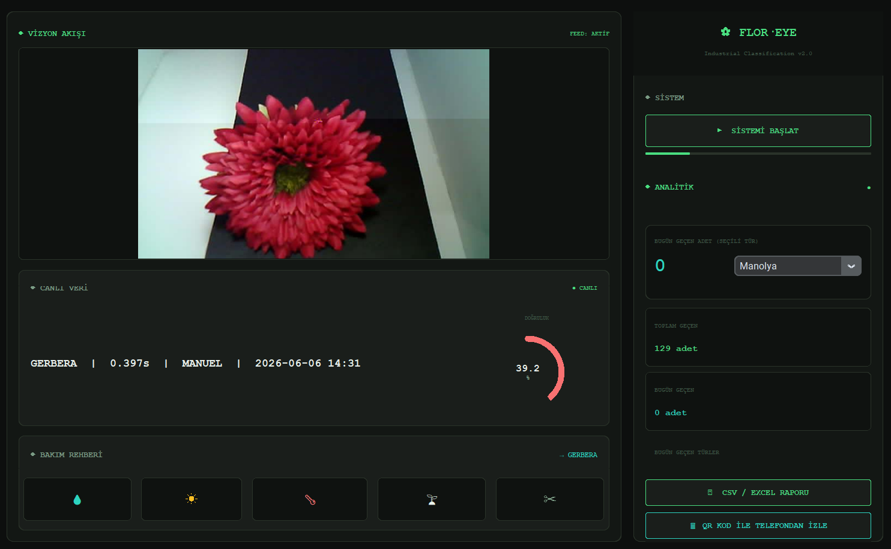
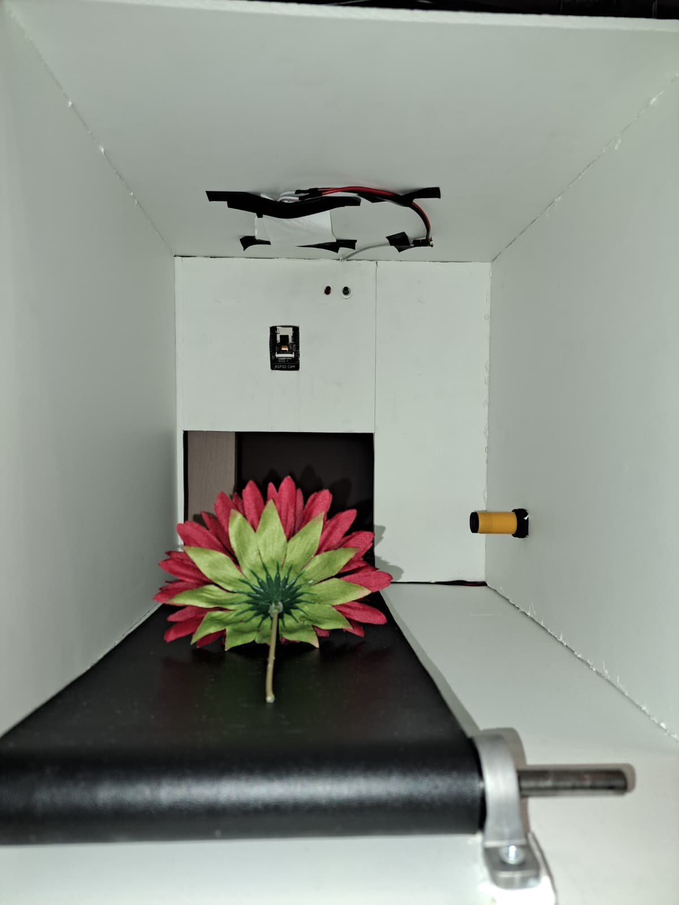
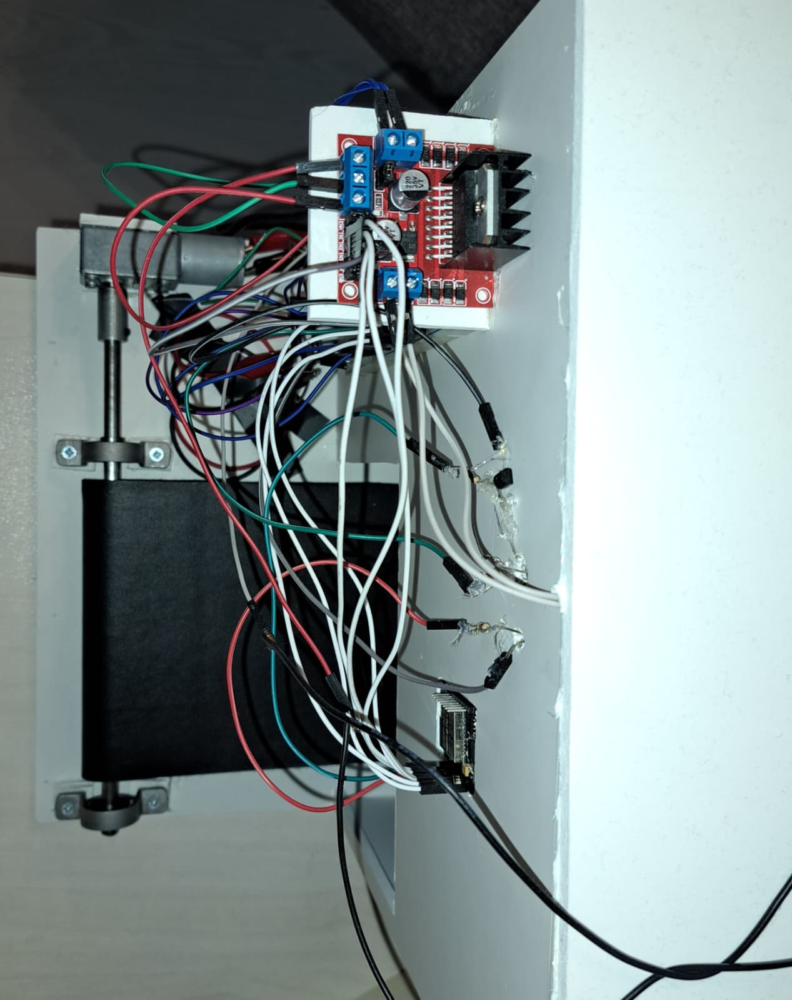
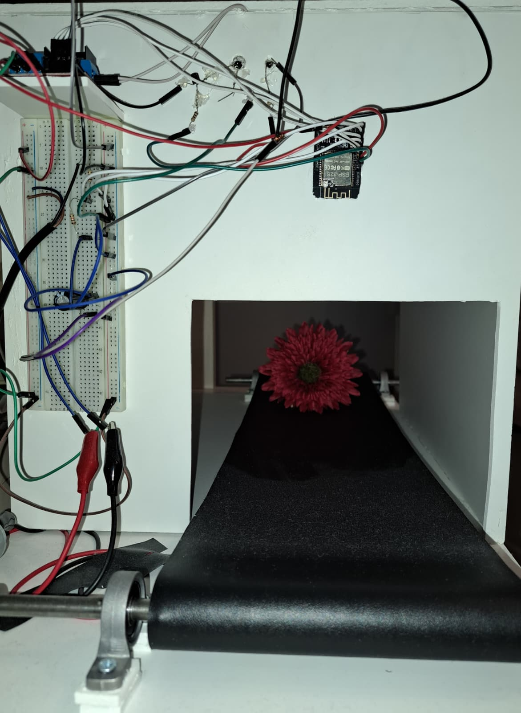

#Otonom Kesme Çiçek Sınıflandırma ve Sayma Sistemi

[EN] Scroll down for the English version of the documentation.

---

### TR TÜRKÇE DOKÜMANTASYON

Bu proje, konveyör bant üzerinden geçen çiçeklerin otonom olarak görüntülenmesi, derin öğrenme (EfficientNet) modeliyle sınıflandırılması, verilerin işlenmesi ve masaüstü kullanıcı arayüzü üzerinden takibini sağlayan **uçtan uca bir gömülü IoT ve yapay zeka otomasyon sistemidir.**

---

## Sistem Görselleri ve Operatör Arayüzü

####Operatör Kontrol Paneli (GUI)
CustomTkinter ile geliştirilen masaüstü arayüzü; ESP32-CAM'dan alınan görüntüyü, tespit edilen çiçek türünü, işlem süresini, güven skorunu ve istatistiksel raporları gösterir.

#### Donanım ve Konveyör Düzeneği

| |  |  |

### Detaylı Çalışma ve Olay Akışı (Workflow)

Sistemin donanım ve yazılım arasındaki adım adım çalışma senaryosu şu şekildedir:

1. **Başlatma:** Operatör, GUI arayüzünden "Sistemi Başlat" komutunu verir.
2. **Hareket:** DC Motor, L298N motor sürücüsü üzerinden tetiklenir ve konveyör bant dönmeye başlar.
3. **Algılama (Sensing):** Çiçek, kızılötesi (IR) mesafe sensörünün önüne geldiğinde sensör durumu değişir.
4. **Durma ve Aydınlatma:** IR sensörün tetiklenmesiyle motor sürücü konveyör bandı anlık olarak durdurur; eş zamanlı olarak tepe LED aydınlatması devreye girer.
5. **Görüntü Yakalama:** ESP32-CAM (OV2640), durdurulan çiçeğin anlık fotoğrafını yakalar ve Wi-Fi üzerinden Flask REST API backend'ine HTTP POST isteği ile iletir.
6. **Sınıflandırma (Deep Learning):** Flask sunucusu (`server.py`), gelen görüntüyü ön işlemeden geçirerek önceden eğitilmiş `final_model.h5` (EfficientNetB0) modeline besler. Model, çiçeğin türünü ve tahmin güven skorunu (confidence) hesaplar.
7. **Veritabanı Kaydı (SQLite):** Sınıflandırılan çiçeğin türü, zaman damgası (timestamp), işlem süresi ve güven skoru SQLite veritabanına otomatik olarak işlenir.
8. **Arayüz Güncellemesi:** GUI üzerindeki sayaçlar, canlı akış görüntüsü ve işlem süresi anlık olarak güncellenir. Alt panelde yer alan Bakım Rehberi bölümündeki simgelerin (ışık, sulama, sıcaklık vb.) üzerine imleç ile gelindiğinde (hover), tespit edilen çiçek türüne ait spesifik bakım bilgileri dinamik olarak görüntülenir.
9. **Döngünün Devamı:** İşlem tamamlandıktan sonra motor yeniden çalışır ve bir sonraki çiçek için süreç tekrarlanır.

---

### Sistem Mimarisi

1-Donanım Katmanı(Hardware):Kızılötesi (IR) sensör konveyördeki çiçeği algıladığında motor durur. ESP32-CAM çiçeğin fotoğrafını çekerek Wi-Fi üzerinden yerel HTTP POST isteği ile backend sunucusuna gönderir.

2-Arka Plan Katmanı(Backend):Flask mimarisi üzerine kurulu REST API, gelen görüntüyü ön işlemeden geçirir ve eğitilmiş derin öğrenme modeline iletir.

3-Yapay Zeka Katmanı(AI):Transfer Learning (EfficientNetB0) mimarisi ile eğitilmiş model, çiçek türünü ve doğruluk (confidence) oranını tahmin eder. Sonuçlar SQLite veritabanına loglanır.

4-Ön Yüz Katmanı(Frontend):CustomTkinter ile geliştirilmiş masaüstü arayüzü; gelen tahmin sonuçlarını, canlı durumu ve simgelerin üzerine gelindiğinde detayları açılan (tooltip) etkileşimli çiçek bakım rehberini kullanıcıya sunar.

---

### Veritabanı Kullanımı (SQLite)

Projeye entegre edilen SQLite veritabanı, **`server.py` (Flask backend) ilk çalıştırıldığında otomatik olarak oluşturulur** ve gerekli tablo yapıları (loglar, sayım verileri ve zaman damgaları) sistem tarafından kendiliğinden hazırlanır.

Projeye entegre edilen SQLite veritabanı aşağıdaki amaçlar için kullanılmaktadır:
* **Çiçek Sayım ve İstatistik Kaydı:** Konveyörden geçen her çiçeğin türünü, tespit edildiği tarih/saati ve modelin tahmin doğruluk oranını saklar.
* **Raporlama:** Operatörün arayüz üzerinden gün bazlı toplam geçen çiçek sayısını, tür bazlı dağılımı ve geçmiş logları "CSV / Excel Raporu" olarak dışa aktarmasına olanak tanır.
* **Sistem Geçmişi:** Arayüzdeki "Toplam Geçen" ve "Bugün Geçen Türler" panellerini dinamik olarak besler.

---

### Saha Testleri, Düşük Doğruluk Nedenleri ve Kısıtlar

Model, eğitim aşamasında yüksek doğruluk oranlarına ulaşmış olsa da canlı testler sırasında (örneğin *Gerbera* türünde %39.2 gibi) düşük güven skorları gözlemlenebilmektedir. Bu durumun teknik nedenleri:

1. **Ortam Aydınlatması ve Parlama:** Sabit ortam ışığının yetersizliği ve yapraklar üzerindeki parlama/gölgeler öznitelik çıkarımını olumsuz etkilemektedir.
2. **Kamera Çözünürlüğü ve Odaklanma:** ESP32-CAM (OV2640) modülünün lens kısıtları ve anlık odaklanma süreleri netlik kaybına yol açabilmektedir.
3. **Açı ve Konum Farklılıkları:** Konveyör bant üzerinde çiçeğin duruş açısı, modelin eğitim veri setindeki standart açılardan farklılık gösterebilmektedir.

---

###PROJE KLASÖR YAPISI

flower-counting-and-classification/
├── software/
│   ├── backend/          # Flask REST API, SQLite Veritabanı Mantığı
│   │   ├── server.py
│   │   ├── final\_model.h5
│   │   └── requirements.txt
│   ├── frontend/         # CustomTkinter Masaüstü Arayüzü
│   │   ├── gui.py
│   │   ├── flower\_information.json
│   │   └── requirements.txt
│   └── ai\_model/         # Model Eğitim Defteri (Jupyter Notebook)
│       └── final-CNN-model.ipynb
├── hardware/
│   └── esp32/            # ESP32-CAM PlatformIO C++ Kodları
│       ├── platformio.ini
│       └── src/
│           └── main.cpp
├── docs/                 # Ekran Görüntüleri ve Sistem Görselleri
└── README.md             # Proje Dokümantasyonu

---

###KURULUM VE ÇALIŞTIRMA

1.Arka Plan Sunucusunu Başlatma

cd software/backend
pip install -r requirements.txt
python server.py

Backend varsayılan olarak http://localhost:5000 veya yerel ağ IP'niz üzerinden dinlemeye başlar. SQLite veritabanı ilk çalıştırmada otomatik oluşturulur.

2.Kullanıcı Arayüzünü Çalıştırma

cd software/frontend
pip install -r requirements.txt
python gui.py

3.Donanım Yüklemesi

hardware/esp32 klasörünü VS Code + PlatformIO ile açın.

main.cpp içindeki Wi-Fi SSID, Parola ve Flask Sunucu IP adresini kendi ağınıza göre güncelleyin.

Kodu ESP32-CAM kartınıza yükleyin (Upload). Gerekli tüm C++ kütüphaneleri platformio.ini dosyasından otomatik indirilecektir.

---

###KULLANILAN TEKNOLOJİLER

Gömülü Sistemler: ESP32-CAM, C++, PlatformIO, Arduino Framework, L298N Motor Sürücü, IR Sensör, 12V DC Motor, Tepe LED Aydınlatma

Yapay Zeka \& Derin Öğrenme: TensorFlow / Keras, EfficientNetB0, NumPy, Pillow

Arka Plan \& Veritabanı: Python, Flask, REST API, SQLite3, JSON, HTTP POST Protokolü

Masaüstü Arayüzü: CustomTkinter, Tkinter, Multi-threading

---

###YAZAR

Zeynep Handan Çakır-Bilgisayar Mühendisi

ENG

#Autonomous Flower Classification and Sorting System

This project is an **end-to-end embedded IoT and deep learning automation system** designed to capture images of flowers moving along a conveyor belt, classify them autonomously using an EfficientNet model, log classification metrics, and monitor real-time operations via a desktop GUI.

---

### System Workflow

Initialization: The operator clicks "Sistemi Başlat" (Start System) on the CustomTkinter GUI interface.

Conveyor Motion: The DC motor is triggered via the L298N driver, starting conveyor movement.

Sensing: As the flower arrives in front of the Infrared (IR) distance sensor, the sensor state flips.

Stop & Illuminate: Triggered by the IR sensor, the motor driver immediately halts the belt, and the top LED module turns on simultaneously.

Image Capture: ESP32-CAM (OV2640) captures an image of the stationary flower and transmits it to the backend server (server.py) via a local HTTP POST request over Wi-Fi.

Classification: The Flask REST API preprocesses the incoming image and forwards it to the trained final_model.h5 (EfficientNetB0) model to predict flower species and confidence score.

Database Logging (SQLite): Classification results, timestamps, processing duration, and confidence scores are automatically stored in an SQLite database.

Frontend Update: Counters, live stream frame, and processing duration are updated in real-time. In the Care Guide section at the bottom, hovering over the respective icons (light, watering, temperature, etc.) dynamically displays detailed care information for the classified flower species via interactive tooltips.

Cycle Resume: Once processed, the conveyor motor restarts to await the next flower.

---

## System Architecture 

Hardware Layer: When the Infrared (IR) sensor detects a flower on the conveyor belt, the motor stops. The ESP32-CAM captures an image and transmits it to the backend server via a local HTTP POST request over Wi-Fi.

Backend Layer: The Flask REST API preprocesses the incoming image and forwards it to the trained deep learning model.

AI Layer: Built using Transfer Learning (EfficientNetB0), the model predicts the flower species and output confidence score. Classification logs are automatically stored in an SQLite database.

Frontend Layer: The desktop interface built with CustomTkinter displays live classification results, system logs, and an interactive flower care guide with hover-activated tooltips for operators.

---

### Database Utilization (SQLite)

The integrated SQLite database is **automatically initialized by `server.py` (Flask backend) upon first run**, dynamically creating the required tables and schema.

The integrated SQLite database serves the following key functions:

Logging & Analytics: Stores flower species, detection timestamps, processing duration, and classification confidence scores for every processed item.

Exportable Reports: Allows operators to export daily totals, class distributions, and log history as CSV/Excel reports directly from the interface.

State Persistence: Dynamically feeds summary panels such as "Total Processed" and "Today's Categories".

---

### Real-World Deployment & Accuracy Considerations

Although the model achieved high validation accuracy during offline training, lower confidence scores (e.g., 39.2% for Gerbera) can occur during live deployment. Technical reasons include:

Ambient Lighting & Reflections: Inconsistent ambient light and glare/shadows on flower petals degrade deep feature extraction.

Camera Sensor Limits: Hardware limitations of the ESP32-CAM (OV2640) lens and focal delay can cause slight motion blur or noise.

Pose & Angle Variations: Variations in flower orientation on the moving belt compared to normalized training datasets.

---

###PROJECT DIRECTORY STRUCTURE

flower-classification-and-sorting-system/

├── software/
│   ├── backend/          # Flask REST API, SQLite Database Logic
│   │   ├── server.py
│   │   ├── final\_model.h5
│   │   └── requirements.txt
│   ├── frontend/         # CustomTkinter Desktop Application
│   │   ├── gui.py
│   │   ├── flower\_information.json
│   │   └── requirements.txt
│   └── ai\_model/         # Model Training Notebook
│       └── final-CNN-model.ipynb
├── hardware/
│   └── esp32/            # ESP32-CAM PlatformIO C++ Source Code
│       ├── platformio.ini
│       └── src/
│           └── main.cpp
├── docs/                 # Screenshots and Project Visuals
└── README.md             # Project Documentation

---

###SETUP AND EXECUTION

1.Starting the Backend Server

cd software/backend
pip install -r requirements.txt
python server.py

The Flask server listens on http://localhost:5000 or your local network IP by default. The SQLite database is automatically initialized on the first run.

2.Running the Desktop Application (Frontend)

cd software/frontend
pip install -r requirements.txt
python gui.py

3. ESP32-CAM Firmware Upload

Open the hardware/esp32 directory in VS Code with PlatformIO.

Update the Wi-Fi credentials (SSID/Password) and Flask server IP address in src/main.cpp.

Upload the firmware to your ESP32-CAM board. Required C++ libraries will be resolved automatically via platformio.ini.

---

###TECH STACK

Embedded Systems: ESP32-CAM, C++, PlatformIO, Arduino Framework, L298N Driver, IR Sensor, 12V DC Motor, Overhead LED Lighting

AI \& Deep Learning: TensorFlow / Keras, EfficientNetB0, NumPy, Pillow

Backend \& Database: Python, Flask, REST API, SQLite3, JSON, HTTP POST Protocol

Frontend: CustomTkinter, Tkinter, Multi-threading

---

###AUTHOR

Zeynep Handan Çakır-Computer Engineer

